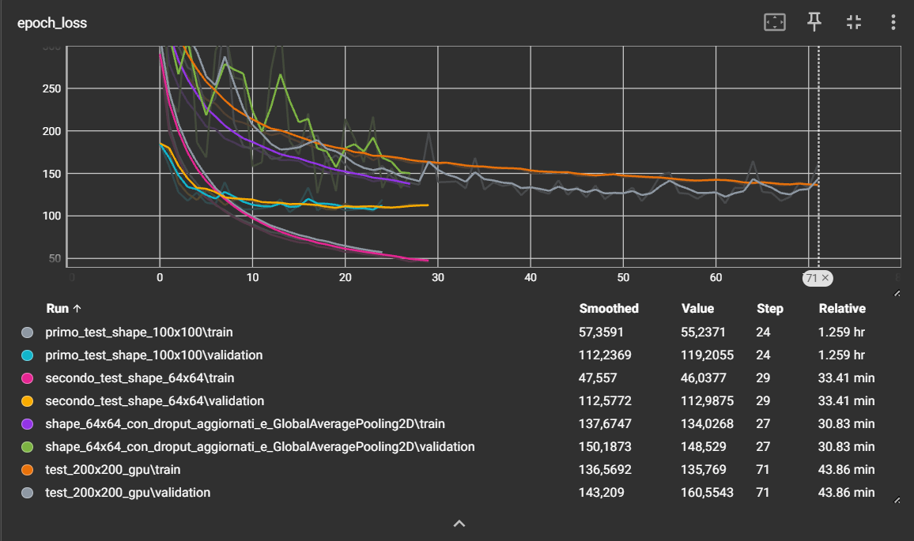

# Stima dell'Età con CNN — UTKFace Dataset

Progetto di Deep Learning per la stima dell'età anagrafica a partire da immagini di volti, realizzato con TensorFlow/Keras e il dataset **UTKFace**.

---

## Struttura del progetto

```
├── esame_finale_dl.ipynb       # Notebook principale: training della CNN
├── test_rete.ipynb             # Notebook di test: confronto tra modelli addestrati
├── requirements.txt            # Dipendenze Python
├── assets/
│   └── epoch_loss.png          # Screenshot log TensorBoard
├── modelli/                    # Modelli addestrati (.keras / .h5)
│   ├── shape_64x64.keras
│   ├── shape_100x100.keras
│   ├── shape_64x64_con_droput_aggiornati_e_GlobalAveragePooling2D.keras
│   └── shape_200x200.h5
├── input/                      # Crea questa cartella e inserisci le immagini da testare
│   └── tua_foto.jpg
├── dataset/                    # Generata automaticamente da kagglehub (non in repo)
│   └── UTKFace/
└── keras/                      # Generata durante il training (non in repo)
    ├── logs/                   # Log TensorBoard
    ├── trainining.log          # Log CSV dell'addestramento
    └── checkpoint-*.keras      # Checkpoint per epoca
```

> La cartella `input/` non è inclusa nella repo: creala manualmente nella root del progetto e inserisci le immagini `.jpg` o `.jpeg` che vuoi usare per testare la rete. Aggiorna il campo `nome_foto` in `test_rete.ipynb` con il nome del file scelto.

---

## Dipendenze

```
tensorflow==2.21.0
keras==3.14.1
numpy==2.4.4
pandas==3.0.3
matplotlib==3.10.9
pillow==12.2.0
scikit-learn==1.8.0
albumentations==2.0.8
```

Installazione:

```bash
pip install -r requirements.txt
```

---

## Dataset

Il dataset utilizzato è **UTKFace**, scaricato automaticamente tramite `kagglehub`:

```python
kagglehub.dataset_download("jangedoo/utkface-new")
```

Le immagini sono file `.jpg` con il nome nel formato:
```
[età]_[genere]_[etnia]_[timestamp].jpg
```
Vengono estratte dall'filename le colonne `age` e `gender` per costruire il DataFrame di lavoro.

---

## Pipeline di Preprocessing

Le immagini vengono elaborate con **Albumentations**:

| Trasformazione | Parametro |
|---|---|
| Resize | 64×64 px |
| HorizontalFlip | p=0.5 |
| RandomBrightnessContrast | p=0.2 |
| Rotate | limit=15°, p=0.5 |
| GaussNoise | p=0.1 |
| Normalize | mean=0.5, std=0.5 |

Il dataset viene poi suddiviso in **train (80%)** e **test (20%)** con `sklearn.train_test_split` (random_state=42, shuffle=True).

---

## Architettura della CNN

Modello `Sequential` con input `(64, 64, 3)`:

| Blocco | Layer | Filtri / Neuroni | Note |
|---|---|---|---|
| 1 | Conv2D + BN + MaxPool + Dropout | 32 | Estrae bordi e linee |
| 2 | Conv2D + BN + MaxPool + Dropout | 64 | Rileva forme e curve |
| 3 | Conv2D + BN + MaxPool + Dropout | 128 | Concetti complessi (rughe, occhiaie) |
| — | GlobalAveragePooling2D | — | Riduce overfitting |
| — | Dense + Dropout | 128 | Combinazione feature |
| — | Dense (output) | 1 | Attivazione `linear` → età |

**Dropout progressivo:** 0.2 → 0.2 → 0.3 → 0.5

---

## Configurazione di Training

```python
optimizer = Adam(learning_rate=1e-3)
loss      = MeanSquaredError()
metrics   = [MeanAbsoluteError()]

epochs     = 100
batch_size = 32
```

**Callbacks attivi:**

- `ModelCheckpoint` — salva il miglior checkpoint per epoca
- `CSVLogger` — log dell'andamento in `keras/trainining.log`
- `TensorBoard` — log in `keras/logs/<nome_esperimento>/`
- `EarlyStopping` — patience=10, restore_best_weights=True

---

## Monitoraggio con TensorBoard



Per avviare TensorBoard in locale:

```bash
tensorboard --logdir keras/logs
```

I log di ogni esperimento sono salvati in sottocartelle separate, così da poter confrontare le run direttamente nell'interfaccia.

---

## Test dei Modelli

Il notebook `test_rete.ipynb` permette di confrontare le predizioni di tutti i modelli su una stessa immagine.

**Modelli confrontati:**

| File | Risoluzione |
|---|---|
| `shape_64x64.keras` | 64×64 |
| `shape_100x100.keras` | 100×100 |
| `shape_64x64_con_droput_aggiornati_e_GlobalAveragePooling2D.keras` | 64×64 |
| `shape_200x200.h5` | 200×200 |

Il preprocessing di test usa un **crop quadrato centrato** + resize alla dimensione attesa, seguito da normalizzazione nell'intervallo `[-1, 1]`.

L'output è una griglia matplotlib con immagine e predizione in anni per ciascun modello.

---

## Metriche

Il modello ottimizza la **Mean Squared Error (MSE)** come loss e monitora la **Mean Absolute Error (MAE)** come metrica interpretabile (errore medio in anni sull'età predetta).
